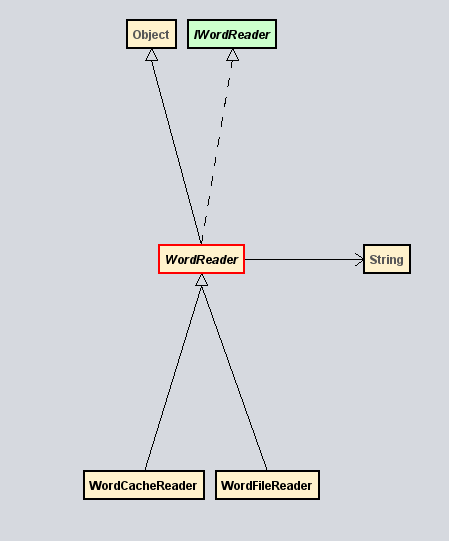

# volga-wordfrequency

[](https://circleci.com/gh/serpent-charmer/volga-wordfrequency/?branch=master)

Архитектура проекта состоит из двух классов, WordFileReader и WordCacheReader, c иерархией вида WordReader->IWordReader.  
Присутствует примитивный Inversion of Control: классы для подсчета слов и чтения кэша не создают зависимости сами,  
а получают их извне в методе read.

```
public interface IWordReader {
	public void read(Connection con, PrintStream printer) throws SQLException;
}
```

</img>

Ниже представлены ссылки на тесты и CI, содержащий собранный JAR-файл.  
Для запуска программы требуется Java 16.

[Код тестов](https://github.com/serpent-charmer/volga-wordfrequency/blob/master/src/test/java/com/volga/wordstats/AppTest.java)  
[Jar](https://30-406640303-gh.circle-artifacts.com/0/target/volga-1.0-SNAPSHOT-jar-with-dependencies.jar)

Запуск тестов:  
`mvn test`

Сборка JAR-файла:  
`mvn clean compile assembly:single`

Использование:
`java -jar volga-1.0-SNAPSHOT-jar-with-dependencies.jar --file=путь_до_файла`  

Перед использованием в консоли рекомендуется поменять кодировку на UTF-8:  
`chcp 65001` в cmd  
`[Console]::OutputEncoding = [Text.UTF8Encoding]::UTF8` в pshell  

Алгоритм работы программы:  
1. Подсчет частоты слов и запись в кэш(SQLite)  
2. Eсли файл не изменился, то вывод набора слов и их частоты в порядке убывания
